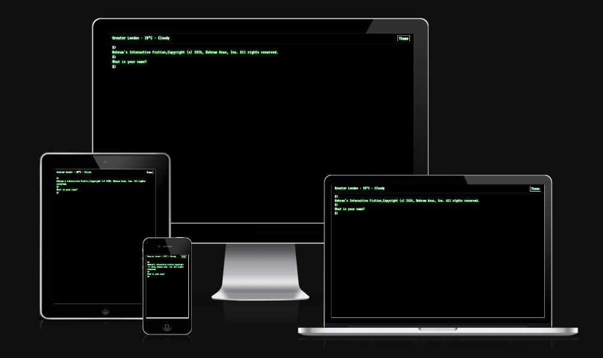
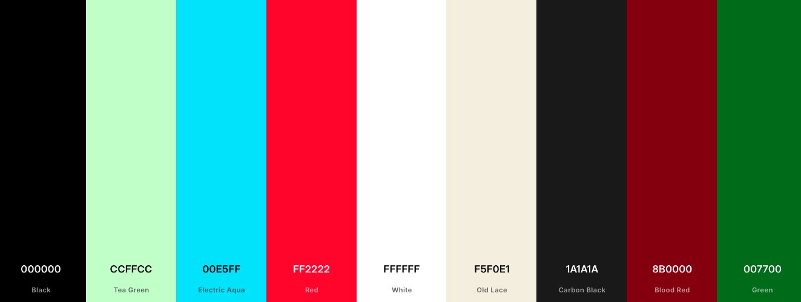
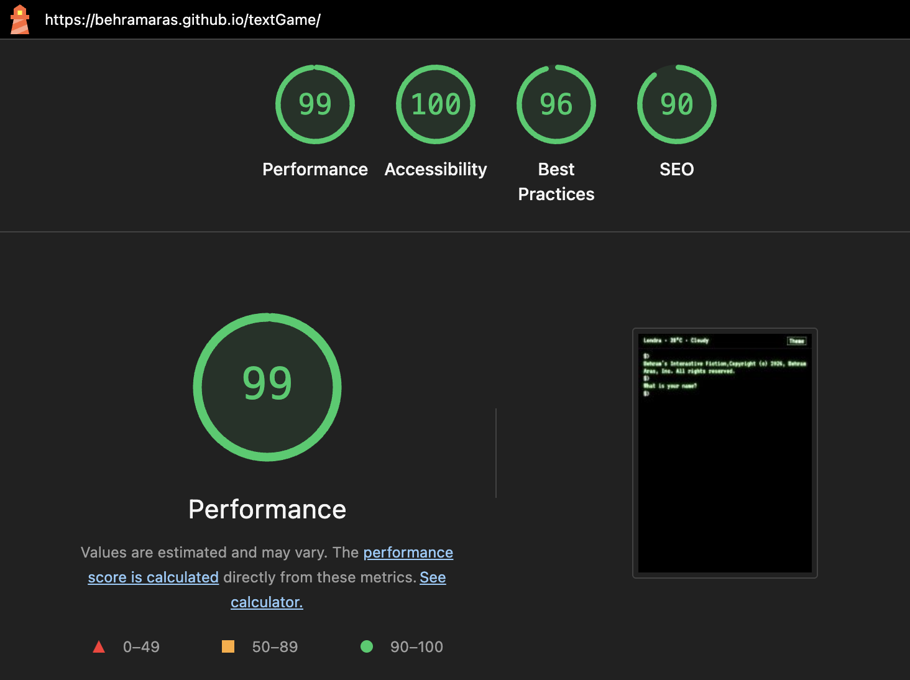
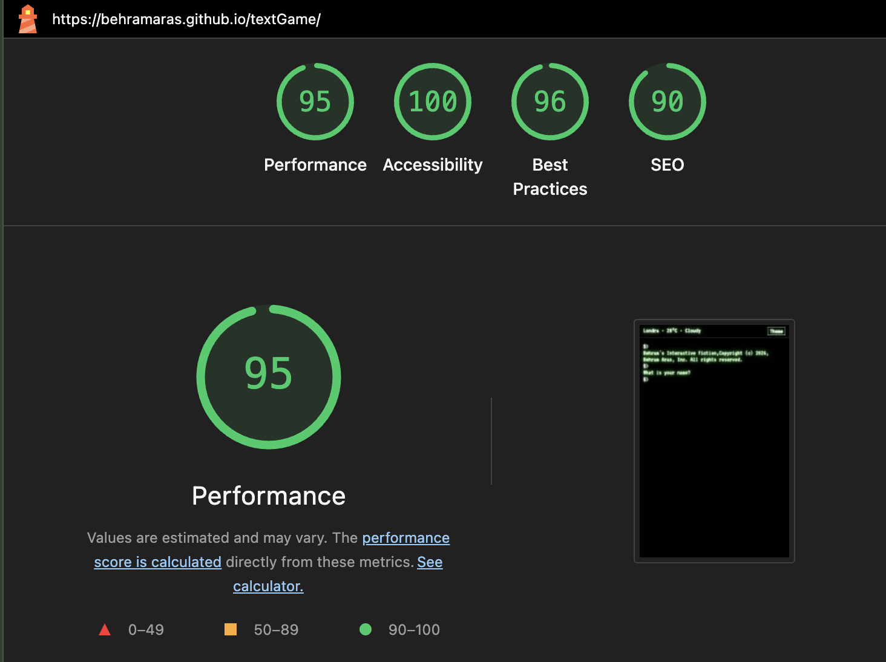

# Behram's Interactive Fiction

Behram's Interactive Fiction is a single-page text adventure game built with HTML, CSS, and vanilla JavaScript. Players explore a haunted house from a retro terminal interface—moving between rooms, reading descriptions, and trying to reach the treasure before a grim fate in the butcher's basement. The experience combines classic interactive fiction with a live weather readout, a dark/light theme toggle, and responsive layout for phones, tablets, and desktops.

**View Site** → [Behram's Interactive Fiction](https://behramaras.github.io/textgame/)



## Table of Contents

- [User Experience (UX)](#user-experience-ux)
  - [Project Goals (User Goals, Design Goals)](#project-goals-user-goals-design-goals)
  - [User Stories (Treasure Hunter, Casual Explorer, Returning Player)](#user-stories-treasure-hunter-casual-explorer-returning-player)
- [Design](#design)
  - [Colour Palette](#colour-palette)
  - [Typography](#typography)
  - [Wireframes](#wireframes)
- [Features](#features)
- [Accessibility](#accessibility)
- [Testing](#testing)
- [Credits](#credits)
  - [Media](#media)
  - [Code and Resources Used](#code-and-resources-used)
  - [Technologies and Tools Used](#technologies-and-tools-used)
- [Deployment and Local Development](#deployment-and-local-development)
  - [Deployment](#deployment)
  - [Local Development (How to Fork, How to Clone, How to Run Locally)](#local-development)
- [AI Tool Usage & Reflection](#ai-tool-usage--reflection)

---

## User Experience (UX)

### Project Goals (User Goals, Design Goals)

#### User Goals

**Treasure hunters** want a short, tense adventure with a clear win condition. They read room descriptions, map exits in their head, and push toward the treasure room while avoiding fatal choices. Sessions are brief but focused—typically one playthrough, with optional replays after a win or loss.

**Casual explorers** treat the game as a mood piece: they enjoy the terminal aesthetic, try a few commands, and see where the story leads. They may not finish on the first visit but often return when they notice the weather widget or theme toggle.

**Returning players** already know the map and want a fast restart after victory or game over. They expect the `restart` command to reset progress, restore the name prompt, and put them back at the starting room without reloading the page.

#### Design Goals

The project aims to deliver a nostalgic command-line feel, keep navigation obvious through movement and look commands, surface win/lose outcomes clearly, and remain usable on small screens without sacrificing readability or keyboard input.

### User Stories (Treasure Hunter, Casual Explorer, Returning Player)

#### Story 1 — Treasure Hunter

**Situation:** A player opens the game determined to find the treasure on the first serious attempt. They want clear feedback when they win or lose and a simple way to try again.

**Story:**

1. Loads the page and enters a name in the terminal when prompted.
2. Reads the welcome message listing available commands.
3. Uses `look up` in the starting room to orient themselves.
4. Moves `north` into the hallway, then `east` toward the treasure room.
5. Sees a victory message when the treasure room is reached; input is locked until they choose to restart.
6. Types `restart` to play again from the beginning.

**Acceptance criteria**

- **Name entry:** First command after the prompt becomes the player name (capitalised) with no browser `prompt()` dialog.
- **Movement:** `north`, `south`, `east`, and `west` update the current room and print the new description.
- **Win state:** Entering `treasureRoom` shows a victory message and blocks further commands until `restart`.
- **Restart:** Resets room, name flow, output, and re-enables input.

#### Story 2 — Casual Explorer

**Situation:** Someone discovers the game on a phone during a break. They skim the retro styling, glance at the weather, and wander without a fixed plan.

**Story:**

1. Opens the site on a mobile viewport and reads the copyright splash.
2. Enters a name and toggles light mode to compare themes.
3. Moves between rooms using direction commands and `look up` to re-read descriptions.
4. Curiosity leads them into the kitchen and they try `look down`.
5. Sees the game over message in the basement and the prompt to type `restart`.

**Acceptance criteria**

- **Responsive layout:** Typography and spacing adapt at tablet (768px) and mobile (480px) breakpoints.
- **Theme toggle:** Dark and light modes switch instantly; preference persists via `localStorage`.
- **Weather widget:** Shows city, temperature, and condition; falls back to London if geolocation is denied.
- **Lose state:** Basement entry ends the run with a visible game over state and restart guidance.

#### Story 3 — Returning Player

**Situation:** A player who lost previously returns later, already knowing the kitchen basement is deadly. They want a clean reset and a quicker second attempt.

**Story:**

1. Opens the saved GitHub Pages URL from a bookmark.
2. Previous theme preference loads automatically in dark mode.
3. Completes a short new session, loses or wins, and types `restart`.
4. Output clears; copyright and name prompt reappear.
5. Starts a fresh run without refreshing the browser tab.

**Acceptance criteria**

- **Theme persistence:** `localStorage` key `textgame-theme` restores dark or light mode on load.
- **Restart flow:** Clears `#output`, resets `currentRoom` to `start`, and restores the in-terminal name entry sequence.
- **Scroll behaviour:** New output scrolls into view inside the terminal area via `scrollToBottom()`.

---

## Design

### Colour Palette

Dark mode uses black backgrounds, phosphor-green body text, and subtle glow effects to evoke a CRT monitor. Light mode switches to a cream page background with dark red accents in the top bar. Semantic classes colour player names, commands, and game-over text without inline styles.

**Dark mode**

| Role | Hex |
|------|-----|
| Background | `#000000` |
| Body text | `#ccffcc` |
| Glow accent | `#00ff00` |
| Player name / commands | `#00e5ff` |
| Weather / theme button | `#ffffff` |
| Game over / victory | `#ff2222` |
| Top bar border | `#333333` |

**Light mode**

| Role | Hex |
|------|-----|
| Background | `#f5f0e1` |
| Body text | `#1a1a1a` |
| Weather / theme button | `#8b0000` |
| Player name / commands | `#007700` |



### Typography

The project uses one display family from [Google Fonts](https://fonts.google.com/), loaded in `index.html`.

**VT323 (terminal font)**

- **Usage:** All terminal output, the command input, weather widget, and theme button (`body`, `#input`, `#weather-widget`, `#theme-toggle` in `assets/css/textgame.css`).
- **Reason:** A monospaced pixel-style face that reinforces the retro command-line identity and keeps command text aligned with the `$>` prompt.

### Wireframes

Wireframes were not created for this project. Layout decisions were made directly in HTML and CSS, using a single scrolling terminal column with a fixed top bar for weather and theme controls.

---

## Features

The repository contains three application files: `index.html`, `assets/css/textgame.css`, and `assets/js/textgame.js`.

### Terminal game core

- **Retro terminal UI:** Green-on-black default theme with scanline-style gradients, text glow, and a flicker animation on output and input.
- **Room-based world:** Five locations—`start`, `hallway`, `treasureRoom`, `kitchen`, and `butchersBasement`—defined in a JavaScript `rooms` object with descriptions and exit maps.
- **Commands:** `look up`, `look down`, `north`, `south`, `east`, `west`, and `restart`.
- **In-terminal name entry:** The first non-empty input after launch becomes the player name; the first letter is capitalised automatically.
- **Input validation:** Empty or whitespace-only commands print *Please enter a command.*
- **End-game handling:** Reaching `treasureRoom` triggers a victory message; `butchersBasement` ends the run. Both states prompt the player to type `restart`.
- **Restart:** Resets room, name flow, game-over flag, output buffer, and input state.

### Theme toggle

- **Dark / light modes:** Toggle button fixed in the top-right corner.
- **Persistence:** Selected theme stored in `localStorage` under `textgame-theme` and applied on load.

### Weather widget

- **Live data:** Open-Meteo forecast API (no API key required).
- **Location:** Browser Geolocation API with fallback to London coordinates (`51.5`, `-0.12`) when permission is denied or unavailable.
- **City name:** Nominatim reverse geocoding API formats output as `City · temperature · condition`.
- **Loading / error states:** Displays *Loading weather…* while fetching and *Weather unavailable* on failure.

### Layout and polish

- **Fixed top bar:** Weather and theme controls stay visible while the terminal scrolls; bar includes a solid background and bottom border.
- **Responsive design:** Media queries at `768px` (tablet) and `480px` (mobile) adjust font sizes and padding.
- **Auto-scroll:** `scrollToBottom()` keeps the latest output visible inside `#terminal`.
- **Semantic HTML:** `<header>` for the top bar and `<main>` for the terminal region.

---

## Accessibility

- Semantic landmarks: `<header>` wraps the top bar; `<main id="terminal">` wraps game content.
- The command `<input>` includes `aria-label="Enter a game command"`.
- The theme button includes `aria-label="Toggle dark and light theme"`.
- The weather widget uses `aria-live="polite"` so screen readers announce updates without interrupting input.
- Colour contrast shifts between dark and light themes; semantic spans (`.highlight`, `.cmd`, `.game-over`) add meaning beyond colour alone for names, commands, and end-game text.
- Keyboard-only play is supported: commands are submitted with Enter; no mouse-only interactions are required for core gameplay.
- Responsive typography reduces eye strain on smaller viewports without hiding essential controls.

---

## Testing

### Validation Testing

#### HTML Validation

`index.html` was tested using the [W3C Markup Validator](https://validator.w3.org/). Screenshots of results are stored in `documentation/errors/validator.v3/`.

**index.html** — No errors


#### CSS Validation

The stylesheet `assets/css/textgame.css` was tested using the [W3C Jigsaw CSS Validator](https://jigsaw.w3.org/css-validator/).

Result: No errors found in custom CSS.


#### JavaScript Linting

`assets/js/textgame.js` was checked with the editor’s JavaScript linter and `node --check` for syntax errors. No issues were reported.

#### Lighthouse Testing

Performance, Accessibility, Best Practices, and SEO were tested using Google Lighthouse. Screenshots stored in `documentation/lighthouse/`.

**Desktop**



**Mobile**



---

## Credits

### Media

- Multi-device mockup created using [Am I Responsive](https://fireship.dev/amiresponsive)
- Colour palette reference image created using [Coolors](https://coolors.co/)

### Code and Resources Used

- Open-Meteo forecast API documentation — [open-meteo.com](https://open-meteo.com/en/docs)
- Nominatim reverse geocoding API — [nominatim.org](https://nominatim.org/release-docs/develop/api/Reverse/)
- MDN Web Docs: Geolocation API — [MDN](https://developer.mozilla.org/en-US/docs/Web/API/Geolocation_API)
- MDN Web Docs: `localStorage` — [MDN](https://developer.mozilla.org/en-US/docs/Web/API/Window/localStorage)
- MDN Web Docs: CSS `@keyframes` — [MDN](https://developer.mozilla.org/en-US/docs/Web/CSS/@keyframes)
- Google Fonts: VT323 — [Google Fonts](https://fonts.google.com/specimen/VT323)

### Technologies and Tools Used

**VS Code** — Code editor used for development

**Git / GitHub** — Version control and repository hosting — [github.com](https://github.com/)

**HTML5** — Page structure and semantic markup

**CSS3** — Custom styling, animations, and responsive layout

**Vanilla JavaScript** — Game logic, API integration, and DOM updates

**[Google Fonts](https://fonts.google.com/)** — VT323

**[Open-Meteo](https://open-meteo.com/)** — Weather data (no API key required)

**[Nominatim](https://nominatim.org/)** — Reverse geocoding for city names (no API key required)

**Browser Geolocation API** — Player location for weather lookup

**localStorage** — Theme preference persistence

**[GitHub Pages](https://pages.github.com/)** — Static site hosting

**[Am I Responsive](https://fireship.dev/amiresponsive)** — Multi-device mockup generator

**[Coolors](https://coolors.co/)** — Colour palette generator

**[W3C Validator](https://validator.w3.org/)** — HTML validation

**[W3C Jigsaw](https://jigsaw.w3.org/css-validator/)** — CSS validation

**[Google Lighthouse](https://developer.chrome.com/docs/lighthouse/)** — Performance, accessibility, SEO, and best practices testing (Chrome DevTools → Lighthouse tab)

---

## Deployment and Local Development

### Deployment

Site deployed using GitHub Pages at Behram's Interactive Fiction

**Steps to deploy a website using GitHub Pages**

1. Open your GitHub repository (`https://github.com/behramaras/textgame`).
2. Open the **Settings** tab.
3. Select **Pages** from the side menu.
4. Under **Branch**, select `main` from the dropdown and click **Save**.
5. Wait a few minutes, then refresh — the live link will appear at the top of the Pages section (published site: `https://behramaras.github.io/textgame/`).

### Local Development

#### How to Fork

1. Log in or create a GitHub account.
2. Go to the repository page: `https://github.com/behramaras/textgame`
3. Click the **Fork** button in the top-right.

Concise steps can be found here: [Fork a repository (GitHub Docs)](https://docs.github.com/en/pull-requests/collaborating-with-pull-requests/working-with-forks/fork-a-repo).

#### How to Clone

1. Open the folder where you would like to clone the project.
2. Open a terminal window.
3. Enter the following command:

   ```bash
   git clone https://github.com/behramaras/textgame.git
   ```

Concise steps can be found here: [Cloning a repository (GitHub Docs)](https://docs.github.com/en/repositories/creating-and-managing-repositories/cloning-a-repository).

#### How to Run Locally

Open the project folder in VS Code and use the **Live Server** extension to preview the site. Right-click `index.html` and select **Open with Live Server**.

> **Note:** The weather widget uses browser geolocation and external APIs. Live Server (or any local HTTP server) is recommended so geolocation and fetch requests behave reliably compared with opening the file directly via `file://`.

---

## AI Tool Usage & Reflection

During development I used AI-assisted coding tools to speed up repetitive tasks, explore implementation options, and troubleshoot issues that were easy to miss by hand.

**How AI tools were used**

- **Code generation:** Drafting boilerplate for the weather widget, theme toggle, and end-game flow before I tightened the logic to match the game design.
- **Debugging:** Tracing why the weather widget stalled on *Loading weather…*, fixing geolocation fallback behaviour, and correcting scroll behaviour so output stayed visible inside the terminal container.
- **UX optimisation:** Iterating on colour classes (`.highlight`, `.cmd`, `.game-over`), responsive breakpoints, and accessibility attributes such as `aria-label` and `aria-live`.

**Reflection**

AI tools acted as a fast second pair of eyes rather than a substitute for understanding the codebase. They helped me ship polish—API integration, theme persistence, validation messages—more quickly, but I still reviewed every change to keep the game logic intact and the retro tone consistent. The biggest benefit was reducing friction on non-game features (weather, themes, responsive CSS) so I could focus on room descriptions and player flow. The main lesson was to treat AI output as a draft: verify behaviour in the browser, keep the scope small, and reject suggestions that added complexity the project did not need.

---

**Author:** Behram Aras · **Year:** 2026 · **Repository:** [github.com/behramaras/textgame](https://github.com/behramaras/textgame)
