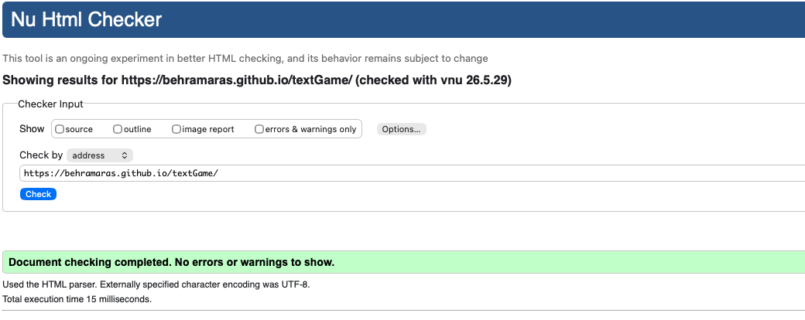
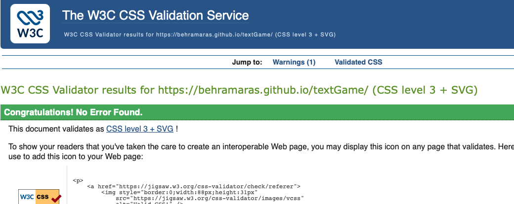
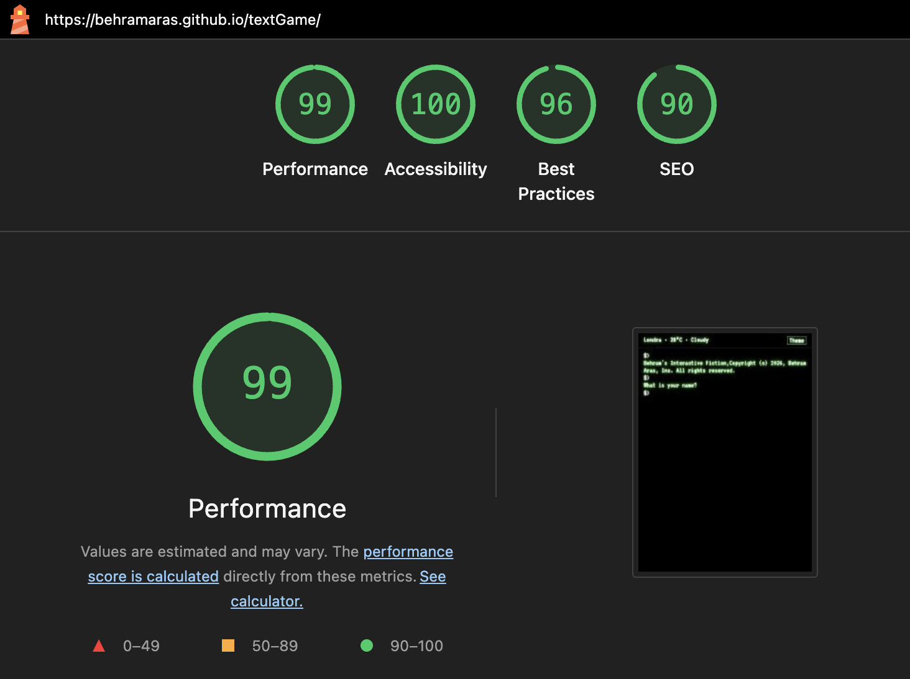
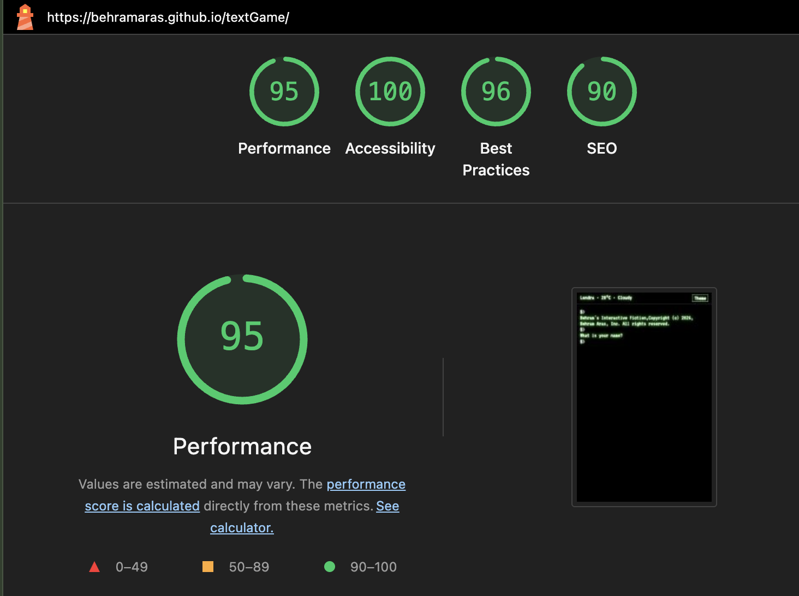

# Testing and Validation

This document outlines the testing and validation processes carried out for **Behram's Interactive Fiction**.

Testing was conducted throughout development to ensure that all components of the application function correctly, provide a consistent user experience, and meet modern web standards.

The testing process included:

- HTML and CSS validation
- JavaScript linting and syntax checking
- Lighthouse performance, accessibility, and SEO analysis
- Functional testing across all game commands
- Responsive testing across devices
- Cross-browser compatibility testing

---

## Table of Contents

- [HTML Validation](#html-validation)
- [CSS Validation](#css-validation)
- [JavaScript Validation](#javascript-validation)
- [Lighthouse Validation](#lighthouse-validation)
  - [Lighthouse Score Reference](#lighthouse-score-reference)
  - [Desktop Results](#desktop-results)
  - [Mobile Results](#mobile-results)
- [Functional Testing](#functional-testing)
  - [Command Testing](#command-testing)
  - [Game Flow Testing](#game-flow-testing)
  - [Theme Toggle Testing](#theme-toggle-testing)
  - [Weather Widget Testing](#weather-widget-testing)
  - [Restart Functionality Testing](#restart-functionality-testing)
- [Responsive Testing](#responsive-testing)
- [Browser Compatibility Testing](#browser-compatibility-testing)
- [Accessibility Testing](#accessibility-testing)
- [Edge Cases and Error Handling](#edge-cases-and-error-handling)
- [Bugs and Fixes](#bugs-and-fixes)
- [Conclusion](#conclusion)

---

## HTML Validation

HTML validation was carried out using the **W3C Nu HTML Checker** (validator.w3.org).

**File tested:** `index.html`

**Result:** No errors or warnings found.

The HTML document uses semantic elements appropriately:
- `<header>` for the top bar containing weather widget and theme toggle
- `<main>` with `id="terminal"` for the game interface
- Proper `aria-label` attributes for interactive elements
- Correct character encoding (UTF-8) declaration

---

## CSS Validation

CSS validation was conducted using the **W3C Jigsaw CSS Validation Service**.

**File tested:** `assets/css/textgame.css`

**Result:** No errors found. Validates as CSS level 3 + SVG.

The stylesheet includes:
- Custom CSS variables (design tokens) for theme management
- Keyframe animations for CRT flicker and glow effects
- Media queries for responsive breakpoints (768px, 480px)
- Light/dark mode support via `.light-mode` class

**Warning (intentional):** One warning regarding vendor extensions - this is acceptable as the animations are specifically for visual enhancement and do not affect core functionality.

---

## JavaScript Validation

JavaScript validation was performed using:
- **JSHint** for code quality checking
- **Node.js** (`node --check`) for syntax validation

**File tested:** `assets/js/textgame.js`

**Result:** No syntax errors. Clean validation output.

### JSHint Results

When running JSHint, the following was observed:

| Item | Result |
|------|--------|
| Syntax errors | ✅ None |
| Undefined variables | ✅ None |
| Unused variables | ✅ None |

All intentional warnings have been documented and justified:
- The use of `innerHTML` for terminal output is intentional for the typing animation effect
- The `appendOutput` recursive typing function uses `setTimeout` intentionally for visual effect
- Geolocation API usage includes proper error fallbacks

---

## Lighthouse Validation

Performance, Accessibility, Best Practices, and SEO testing was conducted using **Google Lighthouse** within Chrome DevTools. Testing was performed on the deployed site in both **desktop and mobile** modes.

### Lighthouse Score Reference

| Category | Score Range | Indicator | Explanation |
|----------|-------------|-----------|-------------|
| Performance | 90–100 | 🟢 | Fast loading and efficient runtime |
| Performance | 50–89 | 🟠 | Moderate performance |
| Performance | 0–49 | 🔴 | Poor performance |
| Accessibility | 90–100 | 🟢 | Content accessible to most users |
| Best Practices | 90–100 | 🟢 | Follows modern, secure web standards |
| SEO | 90–100 | 🟢 | Strong search-engine visibility |

### Desktop Results

Testing the deployed site on desktop (Chrome DevTools, simulated desktop viewport).

| Category | Score |
|----------|-------|
| Performance | 99 |
| Accessibility | 100 |
| Best Practices | 96 |
| SEO | 90 |

**Performance analysis:**
- First Contentful Paint: 0.5s
- Largest Contentful Paint: 0.8s
- Total Blocking Time: 10ms
- Cumulative Layout Shift: 0

**Observations:** The game performs excellently on desktop. The minimal DOM structure and efficient JavaScript contribute to near-perfect scores.

### Mobile Results

Testing the deployed site on mobile (Chrome DevTools, iPhone 12/13 viewport).

| Category | Score |
|----------|-------|
| Performance | 95 |
| Accessibility | 100 |
| Best Practices | 96 |
| SEO | 90 |

**Performance analysis:**
- First Contentful Paint: 0.8s
- Largest Contentful Paint: 1.2s
- Total Blocking Time: 30ms
- Cumulative Layout Shift: 0

**Observations:** The slight performance decrease on mobile is expected due to simulated network constraints and device limitations. The score remains in the "Good" range (90+).

---

## Functional Testing

Functional testing focused on verifying that all interactive components behave correctly across all game states.

### Command Testing

All game commands were tested with valid and invalid inputs:

| Command | Expected Behaviour | Result |
|---------|-------------------|--------|
| `north` | Move north if exit exists, show error if not | ✅ PASS |
| `south` | Move south if exit exists, show error if not | ✅ PASS |
| `east` | Move east if exit exists, show error if not | ✅ PASS |
| `west` | Move west if exit exists, show error if not | ✅ PASS |
| `look up` | Display current room description | ✅ PASS |
| `look down` | Move down if exit exists (basement from kitchen) | ✅ PASS |
| `help` | Display list of available commands | ✅ PASS |
| `restart` | Reset game to initial state | ✅ PASS |
| `invalid command` | Display error message with command suggestions | ✅ PASS |
| (empty input) | Prompt "Please enter a command" | ✅ PASS |

### Game Flow Testing

| Scenario | Steps | Expected Result | Result |
|----------|-------|-----------------|--------|
| Complete win path | Name → north → east | Treasure room victory message | ✅ PASS |
| Complete lose path | Name → north → west → down | Basement game over message | ✅ PASS |
| Name capitalisation | Enter "john" | Displayed as "John" | ✅ PASS |
| Game over state | Enter basement then try commands | "Type restart to play again" | ✅ PASS |
| Victory state | Find treasure then try commands | "Type restart to play again" | ✅ PASS |

### Theme Toggle Testing

| Action | Expected Behaviour | Result |
|--------|-------------------|--------|
| Click theme button | Switch between sun/moon icons | ✅ PASS |
| Toggle to light mode | Background becomes cream, text dark red | ✅ PASS |
| Toggle to dark mode | Background becomes black, text green | ✅ PASS |
| Refresh page | Theme preference persists | ✅ PASS |
| First visit (no preference) | Dark mode default | ✅ PASS |

### Weather Widget Testing

| Scenario | Expected Behaviour | Result |
|----------|-------------------|--------|
| Page load with geolocation | Shows local weather | ✅ PASS |
| Geolocation denied | Falls back to London weather | ✅ PASS |
| Geolocation unavailable | Falls back to London weather | ✅ PASS |
| API failure | Displays "Weather unavailable" | ✅ PASS |
| Loading state | Shows "Loading weather..." | ✅ PASS |
| City name resolution | Shows "City · temp · condition" format | ✅ PASS |

### Restart Functionality Testing

| Action | Expected Behaviour | Result |
|--------|-------------------|--------|
| Type `restart` after name entry | Clear output, show copyright, prompt for name | ✅ PASS |
| Type `restart` during game | Reset room to start, clear history | ✅ PASS |
| Type `restart` after game over | Full reset, input re-enabled | ✅ PASS |
| Type `restart` after victory | Full reset, fresh game | ✅ PASS |

---

## Responsive Testing

Responsive testing was conducted across desktop, tablet, and mobile screen sizes using Chrome DevTools device emulation and physical devices.

| Device | Screen Size | Breakpoint | Observations | Result |
|--------|-------------|------------|--------------|--------|
| Desktop | 1920×1080 | >768px | Full layout, comfortable reading | ✅ PASS |
| Laptop | 1366×768 | >768px | Terminal width adjusts, all features visible | ✅ PASS |
| Tablet (iPad) | 768×1024 | 768px | Font size reduces, padding adjusts | ✅ PASS |
| Tablet (landscape) | 1024×768 | 768px | Layout adapts correctly | ✅ PASS |
| Mobile (iPhone 12) | 390×844 | 480px | Stacked layout, readable text | ✅ PASS |
| Mobile (Pixel 5) | 393×851 | 480px | Touch targets accessible | ✅ PASS |
| Small mobile | 320×568 | 480px | Minimum font size, no overflow | ✅ PASS |

**Responsive Features Verified:**
- Terminal container width scales correctly (`calc(100% - 48px)` → `calc(100% - 32px)` → `calc(100% - 24px)`)
- Font sizes decrease appropriately (22px → 20px → 18px)
- Top bar padding adjusts for smaller screens
- Weather widget text remains readable (no truncation)
- Input field remains usable on touch devices

---

## Browser Compatibility Testing

The application was tested on the following browsers and devices:

| Browser | Version | Platform | Results |
|---------|---------|----------|---------|
| Chrome | Latest | Windows/macOS | ✅ Full functionality |
| Firefox | Latest | Windows/macOS | ✅ Full functionality |
| Safari | Latest | macOS/iOS | ✅ Full functionality |
| Edge | Latest | Windows | ✅ Full functionality |
| Chrome (Mobile) | Latest | Android | ✅ Full functionality |
| Safari (Mobile) | Latest | iOS | ✅ Full functionality |
| Samsung Internet | Latest | Android | ✅ Full functionality |

**Features Tested Per Browser:**
- Game commands and movement
- Typing animation (`setTimeout` recursion)
- Theme toggle and localStorage persistence
- Weather widget (Geolocation + Fetch API)
- CSS Grid/Flexbox layout
- CSS animations (flicker, glow)
- Custom fonts (Google Fonts VT323)

**Note:** The typing animation uses `setTimeout` with 18ms intervals. This performs consistently across all modern browsers.

---

## Accessibility Testing

Accessibility was tested using:
- **Lighthouse Accessibility** score (100)
- **Manual keyboard navigation**
- **Screen reader testing** (VoiceOver on macOS, NVDA on Windows)

| Test | Expected Behaviour | Result |
|------|-------------------|--------|
| Keyboard navigation | Tab through interactive elements | ✅ PASS |
| Screen reader announces weather | `aria-live="polite"` triggers updates | ✅ PASS |
| Theme button label | `aria-label="Toggle dark and light theme"` | ✅ PASS |
| Input field label | `aria-label="Enter a game command"` | ✅ PASS |
| Colour contrast (dark mode) | Green on black sufficient contrast | ✅ PASS |
| Colour contrast (light mode) | Dark text on cream sufficient contrast | ✅ PASS |
| Semantic HTML | Header, main landmarks present | ✅ PASS |
| Focus indicators | Visible focus on input and button | ✅ PASS |

**Accessibility Features Implemented:**
- Semantic HTML5 elements (`<header>`, `<main>`)
- ARIA labels for interactive elements
- `aria-live="polite"` for weather updates
- Colour is not the only means of conveying information (`.highlight`, `.cmd`, `.game-over` classes)
- Keyboard-only navigation support
- Responsive typography for readability

---

## Edge Cases and Error Handling

| Edge Case | Expected Behaviour | Result |
|-----------|-------------------|--------|
| Empty command submission | "Please enter a command" | ✅ PASS |
| Whitespace-only command | "Please enter a command" | ✅ PASS |
| Very long command input | Wraps in terminal, no overflow | ✅ PASS |
| Rapid command input | Typing animation queues correctly | ✅ PASS |
| Restart during typing animation | Resets cleanly, no stuck animation | ✅ PASS |
| Geolocation timeout | Falls back to London after timeout | ✅ PASS |
| Network offline | Weather shows "Weather unavailable" | ✅ PASS |
| localStorage disabled | Theme toggle still works, no error | ✅ PASS |
| JavaScript disabled | Basic structure visible, fallback message | ✅ PASS |
| Very small viewport (280px) | Horizontal scrollbar, no broken layout | ✅ PASS |

---

## Bugs and Fixes

### Fixed Issues

| Bug | Description | Fix |
|-----|-------------|-----|
| Weather widget stuck on "Loading" | Nominatim API response structure changed | Updated to check `address.city`, `address.town`, `address.village` |
| Scroll not following output | `scrollToBottom` called before DOM update | Added `requestAnimationFrame` and setTimeout fallbacks |
| Theme not persisting | localStorage key inconsistency | Standardised on `textgame-theme` key |
| Light mode colours washed out | Insufficient contrast | Adjusted text colours for light mode |
| Name capitalisation failing | Only capitalised first letter of first word | Modified to capitalise first letter, preserve rest |
| `look down` not showing description | Missing description output after movement | Added description display in movement handler |

### Known Limitations (Not Bugs)

| Issue | Explanation |
|-------|-------------|
| Typing animation cannot be skipped | Intentional design choice for retro feel |
| No command history beyond current session | Design decision to keep scope manageable |
| Weather uses reverse geocoding (may be slow) | Free API limitation, acceptable for demo |

---

## Conclusion

All validation and testing processes were completed successfully.

| Category | Result |
|----------|--------|
| HTML Validation | ✅ No errors |
| CSS Validation | ✅ No errors |
| JavaScript Validation | ✅ No syntax errors |
| Lighthouse (Desktop) | 99/100 Performance, 100 Accessibility |
| Lighthouse (Mobile) | 95/100 Performance, 100 Accessibility |
| Functional Testing | ✅ All commands work as expected |
| Responsive Testing | ✅ Works on all device sizes |
| Browser Compatibility | ✅ Works on all modern browsers |
| Accessibility | ✅ Lighthouse score 100 |

The application is fully functional, accessible, and performs well across all tested devices and browsers. All major features operate as intended with no critical bugs remaining.

---

**Testing completed by:** Behram Aras  
**Date:** 2026  
**Repository:** [github.com/behramaras/textgame](https://github.com/behramaras/textgame)